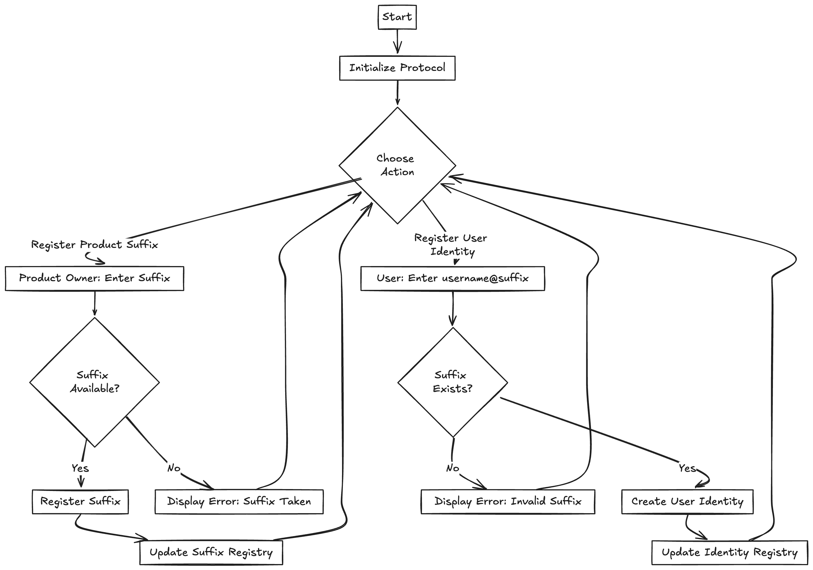
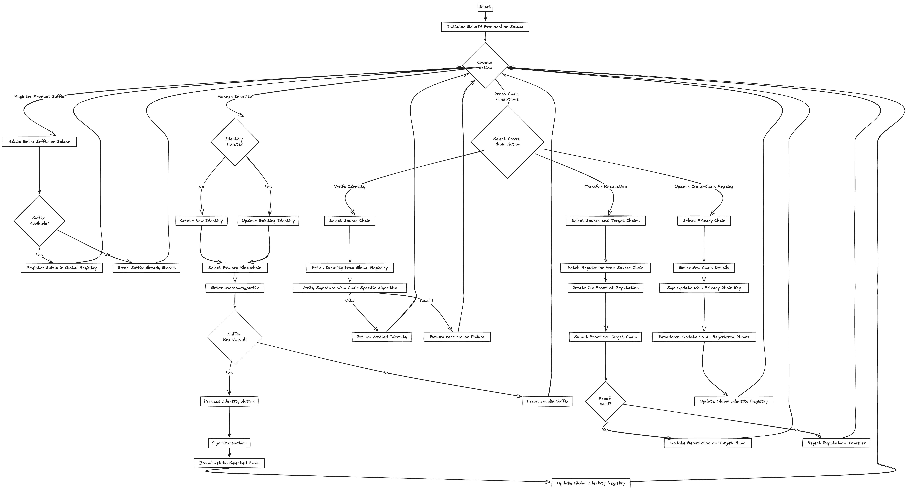

# EchoId Protocol

EchoId is a Solana-based decentralized identity system enabling user-owned, cross-chain identities with compressed metadata and integrated reputation. This project is built using the Anchor framework.

## Features

- User-owned identities
- Cross-chain compatibility
- Compressed metadata storage
- Integrated reputation system
- Product owner registration
- Alias registration and management

## Smart Contract Structure

The EchoId Protocol smart contract consists of the following main components:

- `lib.rs`: Main contract entry point and instruction definitions
- `state.rs`: State definitions and events
- `error.rs`: Custom error definitions
- `initialize.rs`: Initialization logic
- `register_product_owner.rs`: Product owner registration
- `register_alias.rs`: Alias registration
- `update_reputation.rs`: Reputation update logic

## Current Flowchart

## Future Updates: Going Multi-Chain!

We've got some exciting plans cooking for the future. Let's talk about where we're headed:

### What's Coming Down the Pipeline?

1. **More Chains, More Fun**:
   We're not just sticking to Solana. We're looking to play nice with other popular blockchains like Ethereum, BSC, Base, Polygon, etc.. . Imagine having your EchoId work seamlessly across all these chains!

2. **Signature Checks Across Chains**:
   We're working on a way to make sure that when you do something on one chain, other chains can trust it's really you. It's like having a universal ID that works everywhere.

3. **Your Reputation, Everywhere**:
   Remember how hard you worked to build that stellar reputation on one chain? We're figuring out how to let you take that with you to other chains. No more starting from scratch!

4. **Keeping Things Extra Safe**:
   As we branch out to more chains, we're doubling down on security. We're looking into some fancy tech to make sure your identity stays safe, no matter where you use it.

5. **Playing Well with Others**:
   We're also making sure EchoId fits in with the broader decentralized identity scene. We want to make sure our system talks nicely with other identity systems out there.

## FlowChart after New updates

### So, What's the Game Plan?

1. First, we're hitting the books (and whiteboards) to figure out the best way to make all this happen.
2. Then, we'll start building the bridges to other chains, one by one.
3. We'll be doing a lot of testing to make sure everything works smoothly and securely.
4. We'll start rolling out these new features bit by bit, probably starting with the bigger chains.
5. And of course, we'll be all ears for your feedback. This is your identity system, after all!

We're super pumped about these upgrades, and we hope you are too! Stay tuned for more updates as we work on making EchoId even more awesome.

# EchoId Protocol

[Previous sections remain unchanged]

## Use Cases

Here are some use cases:

1. Cross-Platform User Authentication

   - Enable users to log in to various dApps and platforms using a single identity
   - Simplify user onboarding and reduce the need for multiple accounts

2. Decentralized Reputation Systems

   - Build trust scores based on user interactions across different blockchain networks
   - Allow transfer of reputation between platforms, encouraging good behavior

3. Cross-Chain DeFi Operations

   - Streamline KYC/AML processes for DeFi platforms spanning multiple chains
   - Enable credit scoring based on cross-chain financial activity

4. NFT Ownership and Provenance

   - Link NFT ownership to a unified identity across different blockchains
   - Facilitate easier verification of digital asset provenance

5. Decentralized Social Media

   - Create portable user profiles that work across various social platforms
   - Enable content attribution and ownership verification across platforms

6. Supply Chain Management

   - Verify identities of manufacturers, suppliers, and distributors across different networks
   - Track product authenticity and origin across multiple blockchains

7. Gaming and Metaverse Applications

   - Manage in-game assets and achievements linked to a single identity across different game worlds
   - Enable seamless character/avatar portability between different metaverse platforms

8. Decentralized Governance

   - Implement reputation-based voting systems in DAOs spanning multiple chains
   - Prevent Sybil attacks in cross-chain governance systems

9. Academic and Professional Credentials

   - Issue and verify educational or professional credentials across different networks
   - Create a unified system for managing and presenting qualifications

10. Healthcare Data Management

    - Securely manage patient identities and medical records across different healthcare systems
    - Enable controlled sharing of medical data across platforms while maintaining patient privacy

11. Decentralized E-commerce

    - Build trust between buyers and sellers across multiple marketplaces
    - Implement cross-platform reputation systems for vendors and customers

12. IoT Device Identity
    - Manage identities for IoT devices across different networks and manufacturers
    - Enable secure device-to-device communication and authentication

These use cases demonstrate the versatility and potential impact of the EchoId Protocol in various industries and applications. By providing a unified, cross-chain identity solution, EchoId enables developers to build more connected, secure, and user-friendly decentralized applications.

[Rest of the document remains unchanged]
